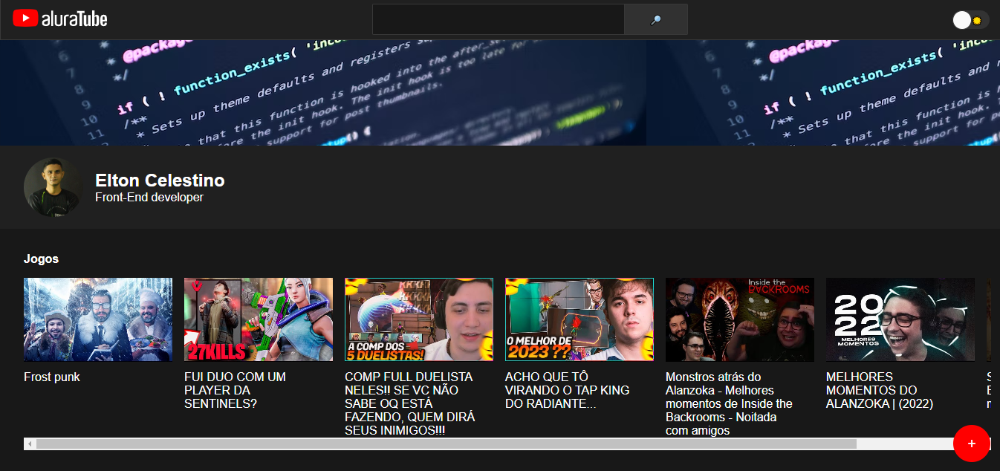
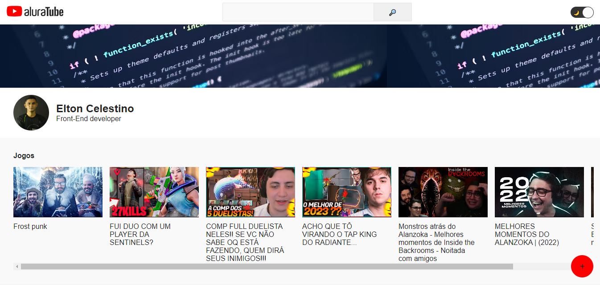
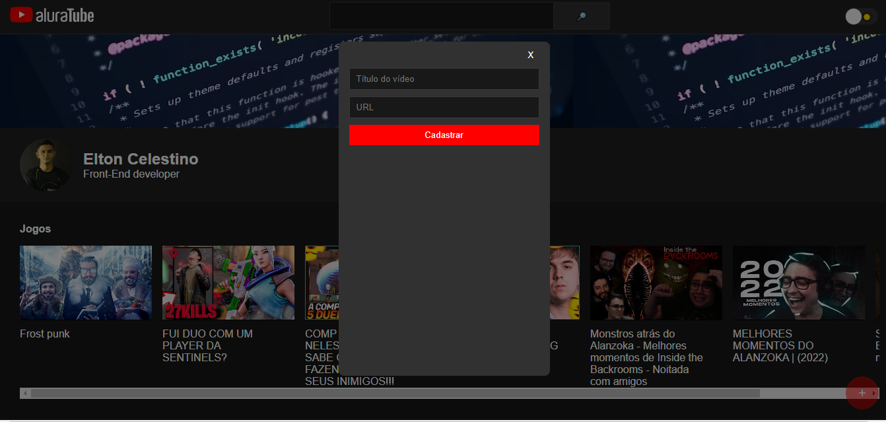

<div style="display: flex; flex-direction: row">

</div>

# AluraTube

Project developed during Alura's React.

### About the project
It was developed using NextJS, Styled Components and Supabase to store registered videos. Important React topics, components, properties, states, hooks, context API were covered. Also discussed was how to consume an API.

### Project demo

<div align="center">
   
   
   
</div>

### Technologies used
* NextJS
* Styled Components
* Supabase
* Context API

### Installation

1. Clone the repo
   ```sh
   git clone https://github.com/github_username/repo_name.git
   ```
2. Install NPM packages
   ```sh
   npm install
   ```
3. Enter your supabase in `.env`
   ```js
   NEXT_PUBLIC_SUPABASE_URL = 'ENTER YOUR PUBLIC URL';
   NEXT_PUBLIC_SUPABASE_ANON_KEY = 'ENTER YOUR PUBLIC KEY';
   ```
4. Run Project
 ```sh
   npm run dev
   ```
